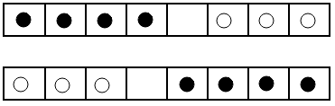

# Отчет по лабораторной работе №3

## по курсу "Логическое программирование"

## Решение задач методом поиска в пространстве состояний

### студент: Милько П.А

## Результат проверки

| Преподаватель     | Дата         |  Оценка       |
|-------------------|--------------|---------------|
| Сошников Д.В. |              |               |
| Левинская М.А.|              |               |

> *Комментарии проверяющих (обратите внимание, что более подробные комментарии возможны непосредственно в репозитории по тексту программы)*

## Введение

Пространство состояний представляет собой набор возможных ситуаций. Из одного состояния возможно перейти в другое состояние используя различные правила перехода. Поэтому удобно использовать такой метод, когда у нас есть два заданных состояния - начальное и конечное, а число всевозможных состояний конечно. Если представить такое пространство как граф, где вершинами являются состояния, то путь от начальной вершины до конечной будет показывать набор состояний, являющийся решением задачи. В итоге, такие задачи сводятся к задаче поиска в графе. Алгоритмы поиска путей в графе подробно  расписаны в курсе дискретной математики, а их реализация на прологе весьма проста(по объёму намного меньше описания алгоритма). В данной лабораторной работе я использовал поиск в глубину, поиск в ширину и поиск с итеративным погружением.

Для представление графа в программировании обычно используют матричное представление, где граф задается при помощи матрицы смежности. В Прологе граф описывается предикатами путем явного перечисления всех дуг в виде пар вершин. Задание графа при помощи дуг является более гибким, чем матрица смежности, поскольку дуги могут задаваться не только явным перечислением, но и при помощи правил, что позволяет нам описывать очень сложные и большие графы, для которых матричное представление нерационально и вообще не всегда возможно.
<!-- Какие задачи удобным образом решаются методом поиска в пространстве состояний? 
Почему Prolog оказывается удобным языком для решения таких задач? -->

## Задание

Вдоль доски расположено 8 лунок, в которых лежат 4 чёрных и 3 белых шара. Необходимо передвинуть чёрные на место белых, а белые - на место чёрных. Шар можно передвинуть в соседнюю с ним пустую лунку, либо в пустую лунку, находящуюся непосредственно за ближайшим шаром. При этом чёрные шары можно передвигать только вправо, а белые - только влево.



<!-- Перенесите сюда условие задачи - это упростит проверку и чтение отчета. -->

## Принцип решения

Собственно для решения задачи необходимо реализовать предикат `prolong`, определяющий дальнейшие возможные действия.

Его реализация основана на следующем предположении: минимальный подсписок исходного списка, в котором может произойти перестановка, будет длины 3 и в нём обязательно будет присутствовать пустой элемент.

На самом деле присутствие пустого элемента в подсписке не необходимо для работы предиката, но в таком подсписке не может быть перестановки. Поэтому логично отсечь заранее ложные варианты.

Собственно в подсписке длины 3 может быть всего 4 варианта перестановок (описаны в предикате `move`):

* `[*, Elem, w]` - **w** может перескочить через элемент
* `[b, Elem, *]` - **b** может перескочить через элемент
* `[_, *, w] или [*, w, _]` - **w** может переместиться в пустую ячейку слева
* `[_, b, *] или [b, *, _]` - **b** может переместиться в пустую ячейку справа

Реализация предикатов:

```prolog
move(In, Out) :-
    (   In=[*, Elem, w], % w может идти влево, через одну ячейку
        Out=[w, Elem, *]
    ;   append(Sub, [b, *|End], In), % Если есть пара b,*
        append(Sub, [*, b|End], Out)
    ;   append(Sub, [*, w|End], In), % Если есть пара *,w
        append(Sub, [w, *|End], Out)
    ;   In=[b, Elem, *], % b может идти только вправо, через одну ячейку
        Out=[*, Elem, b]
    ).

prolong(In, Out) :-
    (   A=(*) % Так немного быстрее
    ;   B=(*)
    ;   C=(*)
    ),
    append(Head, [A, B, C|Tail], In),
    move([A, B, C], [D, E, F]),
    append(Head, [D, E, F|Tail], Out).
prolong([A|T], [B, A|T]) :- % Эта часть была добавлена позже,так как
    prolong                 % для итеративного поиска и поиска в ширину необходимо
prolong([], []).            % запоминать предыдущие шаги

```

## Алгоритмы поиска

Поиск в глубину:

```prolog
dpth([X|T], X, [X|T]).
dpth([P|T], F, L) :-
    prolong(P, P1),
    dpth([P1, P|T], F, L).
```

Из всех остальных алгоритмов поиска пути в графах этот является самым простым. При неудачном завершении пути пролог поднимается по дереву вариантов, пока не доходит до предиката `prolong`, который и обеспечивает перебор решений.

Поиск в ширину:

```prolog
width([[X|T]|_], X, [X|T]). % конец рекурсии, необходимый путь найден
width([P|QI], Search_Elem, Res) :-
    findall(Z, prolong(P, Z), From_P),
    append(QI, From_P, Q0), % вместо Р добавляем в конец списка все пути из него
    width(Q0, Search_Elem, Res).
```

Из использованных в лабораторной алгоритмов поиска этот алгоритм принёс больше всего проблем, так как я просто запутался во вложенных массивах (тогда же я додумался до модификации предиката `prolong`)

Поиск итерациями:

```prolog
int(1).
int(X) :-
    int(Y),
    X is Y+1.

iter([Finish|T], Finish, [Finish|T], 0).
iter(Path, Finish, R, N) :-
    N@>0,
    prolong(Path, NewPath),
    N1 is N-1,
    iter(NewPath, Finish, R, N1).
```

Поиск в глубину редко применяется для поиска пути т.к. найденный путь не обязательно будет оптимальным. Но можно модифицировать поиск в глубину так, чтобы он искал оптимальный путь. Для этого циклично используется поиск в глубину, увеличивая ограничение глубины с каждой итерацией. В таком случае мы получим минимально необходимую глубину для нахождения пути. (увы, но такая оптимизация не имеет в прологе никакого смысла, так как предыдущие итерации сохранить нельзя и они будут высчитываться заново)
<!-- Опишите своими словами принцип решения задачи, приведите важные фрагменты кода. Какие алгоритмы поиска вы использовали?  -->

## Результаты

При просмотре результатов поиска в глубину обнаружилось, что существует всего 2 варианта решения:

```prolog
[b,b,b,b,*,w,w,w]
[b,b,b,*,b,w,w,w]
[b,b,b,w,b,*,w,w]
[b,b,b,w,b,w,*,w]
[b,b,b,w,*,w,b,w]
[b,b,*,w,b,w,b,w]
[b,*,b,w,b,w,b,w]
[b,w,b,*,b,w,b,w]
[b,w,b,w,b,*,b,w]
[b,w,b,w,b,w,b,*]
[b,w,b,w,b,w,*,b]
[b,w,b,w,*,w,b,b]
[b,w,*,w,b,w,b,b]
[*,w,b,w,b,w,b,b]
[w,*,b,w,b,w,b,b]
[w,w,b,*,b,w,b,b]
[w,w,b,w,b,*,b,b]
[w,w,b,w,*,b,b,b]
[w,w,*,w,b,b,b,b]
[w,w,w,*,b,b,b,b]

Solution length: 20
true ;
[b,b,b,b,*,w,w,w]
[b,b,b,b,w,*,w,w]
[b,b,b,*,w,b,w,w]
[b,b,*,b,w,b,w,w]
[b,b,w,b,*,b,w,w]
[b,b,w,b,w,b,*,w]
[b,b,w,b,w,b,w,*]
[b,b,w,b,w,*,w,b]
[b,b,w,*,w,b,w,b]
[b,*,w,b,w,b,w,b]
[*,b,w,b,w,b,w,b]
[w,b,*,b,w,b,w,b]
[w,b,w,b,*,b,w,b]
[w,b,w,b,w,b,*,b]
[w,b,w,b,w,*,b,b]
[w,b,w,*,w,b,b,b]
[w,*,w,b,w,b,b,b]
[w,w,*,b,w,b,b,b]
[w,w,w,b,*,b,b,b]
[w,w,w,*,b,b,b,b]

Solution length: 20
```

Эти варианты решения зеркальны по перестановкам элементов и выбор варианта осуществляется первым действием.

<!-- Приведите результаты работы программы: найденные пути, время, затраченное на поиск тем или иным алгоритмом, длину найденного первым пути. Используйте таблицы,
если необходимо. -->

| Алгоритм поиска |  Длина найденного первым пути  |      Время работы        |
|-----------------|--------------------------------|--------------------------|
| В глубину       |               20               |   0.002220358167375837   |
| В ширину        |               20               |   0.07011222839355469    |
| Итерации        |               20               |   0.23424911499023438    |

> *Результаты поиска несколько различались по времени, поэтому в таблице приведены средние результаты*

## Выводы

<!-- Сформулируйте *содержательные* выводы по лабораторной работе. 
Чему она вас научила? Над чем заставила задуматься? 

Какие алгоритмы поиска в каких случаях удобно использовать? Какие оказались оптимальными в вашем конкретном случае?

Помните, что несодержательные выводы -
самая частая причина снижения оценки за лабораторную. -->

Все три алгоритма справились со своей задачей, но наиболее эффективным оказался, на удивление, поиск в глубину. Он нашел решение **намного** быстрее других, при одинаковом количестве шагов.

Поиск в ширину имеет экспоненциальную сложность как по времени, так и по памяти (на определённых входных данных он может привести к переполнению стека и падению из за нехватке памяти). Поиск в глубину, весьма экономичен по памяти, но в своей наивной реализации неустойчив, и расточителен по времени, как и поиск в ширину. Конечно, может повезти, и решение найдется сразу, но на практике это маловероятно (иронично что так и получилось).

Для различных задач подходят различные виды поиска, и выбор должен зависеть от цели. В условиях ограничения по памяти лучше использовать поиск в глубину, а с целью поиска кратчайшего пути - поиск в ширину. Поиск с итеративным углублением хоть и избегает экспоненциальной сложности, но пригоден только для самых простых задач. Конечно, лучше всего использовать эвристический поиск, что чаще и делают на практике. В отличие от использованных мной алгоритмов, эвристический поиск ищет в пространстве состояний более целенаправленно, т.к. имеет функцию оценки состояния. Вообще стратегии использования пространства состояний очень удобны, мне не нужно было для каждого поиска формулировать задачу заново или вносить в формулировку изменения.
